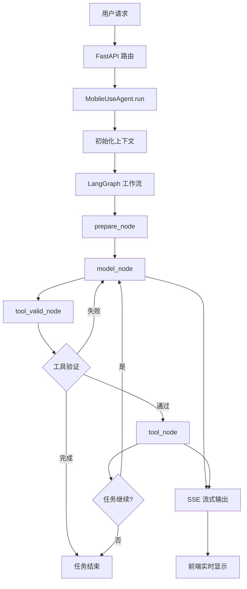
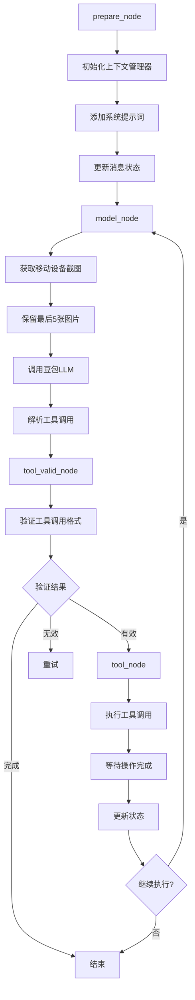

# Mobile Agent 核心逻辑与架构分析

## 项目概述

Mobile Agent 是基于 Python FastAPI 的 AI 智能体核心服务，采用 LangGraph 工作流引擎，通过豆包视觉大模型实现移动设备的智能自动化操作。该项目是整个 Mobile Use 解决方案的大脑，负责 AI 推理、决策制定和任务编排。

## 核心架构

### 1. 项目结构

```
mobile_agent/
├── mobile_agent/
│   ├── agent/              # 核心代理逻辑
│   │   ├── mobile_use_agent.py    # 主代理类
│   │   ├── graph/          # LangGraph工作流
│   │   ├── tools/          # 工具管理
│   │   ├── prompt/         # 提示词模板
│   │   ├── memory/         # 记忆管理
│   │   ├── mobile/         # 移动设备交互
│   │   ├── llm/           # 大语言模型接口
│   │   ├── cost/          # 成本计算
│   │   ├── infra/         # 基础设施
│   │   └── utils/         # 工具函数
│   ├── config/            # 配置管理
│   ├── routers/           # API路由
│   ├── service/           # 业务服务
│   ├── middleware/        # 中间件
│   └── exception/         # 异常处理
├── config.toml           # 配置文件
├── pyproject.toml       # 项目配置
└── main.py             # 应用入口
```

### 2. 核心组件

#### 2.1 MobileUseAgent 主代理类
- **位置**: `mobile_agent/agent/mobile_use_agent.py`
- **职责**: 智能体的主控制器，协调各个组件完成任务
- **核心功能**:
  - 初始化移动客户端和工具
  - 管理执行上下文和状态
  - 协调 LangGraph 工作流执行
  - 处理流式响应和成本计算

#### 2.2 LangGraph 工作流引擎
- **位置**: `mobile_agent/agent/graph/`
- **核心文件**:
  - `builder.py`: 工作流构建器
  - `nodes.py`: 工作流节点实现
  - `context.py`: 上下文管理

#### 2.3 豆包 LLM 集成
- **位置**: `mobile_agent/agent/llm/doubao.py`
- **功能**: 
  - 集成豆包视觉大模型
  - 支持流式和非流式响应
  - 成本计算和 Token 统计

#### 2.4 MCP 工具集成
- **位置**: `mobile_agent/agent/tools/mcp.py`
- **功能**: 通过 MCP 协议与移动设备交互

## 核心逻辑流程

### 主要执行流程



### LangGraph 工作流详细流程



## 关键技术实现

### 1. 智能体状态管理

#### MobileUseAgentState
```python
class MobileUseAgentState(TypedDict):
    user_prompt: str           # 用户输入
    iteration_count: int       # 迭代次数
    task_id: str              # 任务ID
    thread_id: str            # 线程ID
    is_stream: bool           # 是否流式
    max_iterations: int       # 最大迭代次数
    step_interval: float      # 步骤间隔
    messages: List[BaseMessage]  # 消息历史
    tool_call: dict           # 工具调用
    tool_output: dict         # 工具输出
```

### 2. 工具调用机制

#### 工具验证和执行
- **工具验证**: 检查工具调用格式和参数有效性
- **工具执行**: 通过 MCP 协议调用移动设备操作
- **结果处理**: 解析工具执行结果并更新状态

### 3. 流式响应系统

#### SSE 事件类型
- **think**: 思考过程
- **summary**: 总结信息
- **tool_input**: 工具输入
- **tool_output**: 工具输出
- **user_interrupt**: 用户中断

### 4. 成本计算系统

#### CostCalculator
- **Token 统计**: 输入和输出 Token 计数
- **成本计算**: 基于模型定价计算使用成本
- **步骤跟踪**: 记录执行步骤和迭代次数

## API 接口设计

### 1. 会话管理 API

#### POST `/mobile-use/api/v1/session/create`
- **功能**: 创建新的会话
- **参数**: 
  - `thread_id`: 线程ID（可选）
  - `product_id`: 产品ID
  - `pod_id`: 设备ID

#### GET `/mobile-use/api/v1/session/{thread_id}`
- **功能**: 获取会话信息
- **返回**: 会话状态和配置信息

### 2. 智能体 API

#### POST `/mobile-use/api/v1/agent/stream`
- **功能**: 流式执行智能体任务
- **参数**:
  - `thread_id`: 会话ID
  - `message`: 用户指令
- **返回**: SSE 流式响应

#### POST `/mobile-use/api/v1/agent/cancel`
- **功能**: 取消正在执行的任务
- **参数**: `thread_id`

## 配置管理

### 1. 环境配置

#### 必需配置
```toml
[mobile_use_mcp]
url = "http://localhost:8080/mcp"

[ark]
api_key = "your_ark_api_key"
model_id = "your_model_id"

[acep]
ak = "your_access_key"
sk = "your_secret_key"
account_id = "your_account_id"

[tos]
bucket = "your_bucket"
region = "your_region"
endpoint = "your_endpoint"
```

### 2. 模型配置

#### 支持的模型
- 豆包视觉大模型
- OpenAI GPT 系列
- Anthropic Claude 系列
- 其他兼容 OpenAI API 的模型

## 优势与特点

### 1. 技术优势
- **LangGraph 工作流**: 可视化的状态机管理
- **流式响应**: 实时反馈用户操作进度
- **模块化设计**: 易于扩展和维护
- **成本控制**: 精确的使用成本计算

### 2. 智能化特性
- **视觉理解**: 基于截图的智能操作
- **上下文记忆**: 保持对话和操作历史
- **错误恢复**: 自动重试和错误处理
- **任务分解**: 复杂任务的智能分解

### 3. 集成能力
- **MCP 协议**: 标准化的工具调用接口
- **多模型支持**: 灵活的 LLM 提供商切换
- **云手机集成**: 与火山引擎云手机深度集成

## 扩展性设计

### 1. 工具扩展
- 支持自定义工具开发
- 标准化的工具接口
- 动态工具加载机制

### 2. 模型扩展
- 支持新的 LLM 提供商
- 可配置的模型参数
- 模型性能监控

### 3. 平台扩展
- 支持不同的移动平台
- 可扩展的设备操作接口
- 跨平台兼容性

Mobile Agent 作为整个 Mobile Use 解决方案的核心大脑，通过先进的 AI 技术和工程实践，实现了高效、智能、可扩展的移动设备自动化能力。
