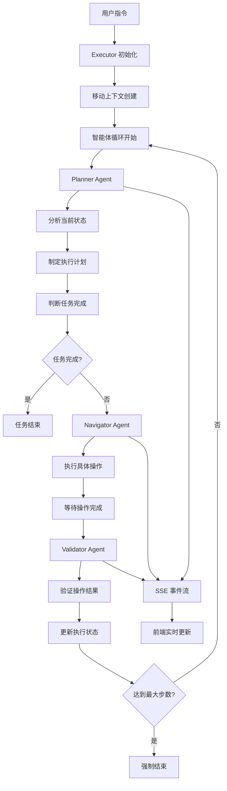
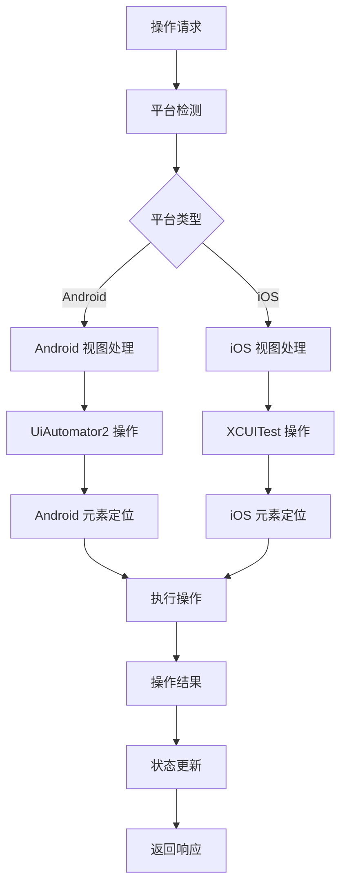
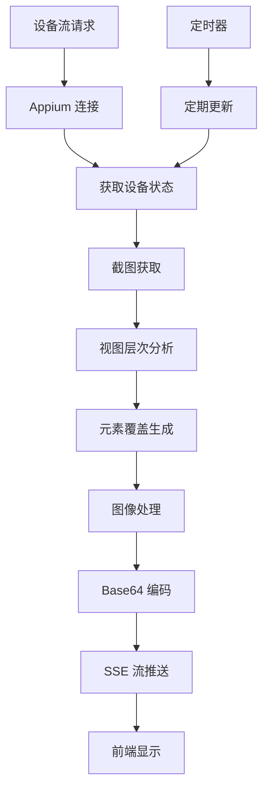

# Mobile-Use 核心逻辑与架构分析

## 项目概述

Mobile-Use 是一个基于自然语言指令执行移动设备任务的智能代理系统。该项目采用多智能体架构，通过 Appium 实现跨平台移动设备自动化，支持实时流式响应和多种 LLM 提供商，现已完整支持 Android 和 iOS 平台。

## 核心架构

### 1. 项目结构

```
mobile-use/src/
├── app/                    # Next.js 应用路由
│   ├── api/               # API 路由处理器
│   │   ├── agent/         # 智能体 API
│   │   ├── health/        # 健康检查
│   │   ├── play/          # 设备流 API
│   │   └── platform/      # 平台配置 API
│   ├── page.tsx          # 主页面
│   └── layout.tsx        # 根布局
├── components/            # React 组件
│   ├── AgentPanel.tsx    # 智能体面板
│   ├── DeviceStream.tsx  # 设备流显示
│   ├── MessageList.tsx   # 消息列表
│   ├── ChatInput.tsx     # 聊天输入
│   ├── SettingsPanel.tsx # 设置面板
│   └── PlatformSelector.tsx # 平台选择器
├── lib/                  # 核心库
│   ├── agent/           # 智能体系统
│   │   ├── agents/      # 三个智能体实现
│   │   ├── executor.ts  # 执行器
│   │   ├── actions/     # 动作系统
│   │   ├── messages/    # 消息管理
│   │   └── event/       # 事件系统
│   ├── mobile/          # 移动设备操作
│   │   ├── appium.ts    # Appium 集成
│   │   ├── context.ts   # 移动上下文
│   │   ├── types.ts     # 类型定义
│   │   ├── platformConfig.ts # 平台配置
│   │   ├── androidViewProcessor.ts # Android 视图处理
│   │   ├── iosViewProcessor.ts     # iOS 视图处理
│   │   └── canvasOverlay.ts        # 画布覆盖
│   ├── settings/        # 配置管理
│   │   ├── llmProviders.ts    # LLM 提供商
│   │   ├── agentModels.ts     # 智能体模型
│   │   └── generalSettings.ts # 通用设置
│   └── utils/           # 工具函数
│       └── logger.ts    # 日志系统
└── types/               # TypeScript 类型
```

### 2. 核心组件

#### 2.1 多智能体系统
- **Planner Agent**: 任务规划和分析
- **Navigator Agent**: 具体操作执行
- **Validator Agent**: 结果验证

#### 2.2 跨平台移动操作
- **Android 支持**: UiAutomator2 驱动
- **iOS 支持**: XCUITest 驱动
- **统一接口**: 平台无关的操作抽象

#### 2.3 实时通信系统
- **SSE 流式响应**: 实时反馈执行进度
- **事件驱动**: 基于事件的状态管理
- **设备流**: 实时设备屏幕流

## 核心逻辑流程

### 多智能体协作流程



### 跨平台操作流程



### 设备流处理流程



## 关键技术实现

### 1. 多智能体系统

#### Executor 核心类
```typescript
export class Executor {
  private mobileContext: MobileContext;
  private plannerAgent: PlannerAgent;
  private navigatorAgent: NavigatorAgent;
  private validatorAgent: ValidatorAgent;
  
  async execute(task: string): Promise<void> {
    let step = 0;
    const maxSteps = this.getMaxSteps();
    
    while (step < maxSteps) {
      // 规划阶段
      const plan = await this.plannerAgent.plan(task, this.mobileContext);
      if (plan.done) break;
      
      // 执行阶段
      const result = await this.navigatorAgent.execute(plan.actions);
      
      // 验证阶段
      const validation = await this.validatorAgent.validate(result);
      
      // 更新状态
      this.updateState(validation);
      step++;
    }
  }
}
```

#### 智能体基类
```typescript
abstract class BaseAgent {
  protected llm: LLMProvider;
  protected messageManager: MessageManager;
  
  abstract async process(input: any): Promise<any>;
  
  protected async callLLM(messages: Message[]): Promise<string> {
    return await this.llm.chat(messages);
  }
}
```

### 2. 跨平台移动操作

#### 平台配置管理
```typescript
export class PlatformConfigManager {
  private currentConfig: PlatformConfig;
  
  switchToAndroid(deviceName?: string): void {
    this.currentConfig = {
      platform: Platform.ANDROID,
      capabilities: {
        platformName: 'Android',
        'appium:automationName': 'UiAutomator2',
        'appium:deviceName': deviceName || 'Android Emulator',
      }
    };
  }
  
  switchToIOS(deviceName?: string): void {
    this.currentConfig = {
      platform: Platform.IOS,
      capabilities: {
        platformName: 'iOS',
        'appium:automationName': 'XCUITest',
        'appium:deviceName': deviceName || 'iPhone Simulator',
      }
    };
  }
}
```

#### 移动上下文
```typescript
export default class MobileContext {
  private driver: any;
  private platformConfig: PlatformConfig;
  
  async getState(): Promise<MobileState> {
    const screenshot = await this.takeScreenshot();
    const pageSource = await this.driver.getPageSource();
    
    // 根据平台选择处理器
    const processor = this.platformConfig.platform === Platform.ANDROID
      ? processAndroidPageSource
      : processIOSPageSource;
    
    const { interactiveElements } = await processor(pageSource);
    
    return {
      platform: this.platformConfig.platform,
      screenshot,
      interactiveElements,
      currentApp: await this.getCurrentApp(),
    };
  }
}
```

### 3. 实时通信系统

#### SSE 事件管理
```typescript
export class EventManager {
  private eventEmitter = new EventEmitter();
  
  emit(event: ExecutionEvent): void {
    this.eventEmitter.emit('execution_event', event);
  }
  
  subscribe(callback: (event: ExecutionEvent) => void): void {
    this.eventEmitter.on('execution_event', callback);
  }
}

// 事件类型
export enum ExecutionState {
  TASK_START = 'task_start',
  STEP_START = 'step_start',
  STEP_OK = 'step_ok',
  STEP_FAIL = 'step_fail',
  TASK_COMPLETE = 'task_complete',
}
```

#### API 路由实现
```typescript
// app/api/agent/route.ts
export async function GET(request: NextRequest) {
  const encoder = new TextEncoder();
  
  const stream = new ReadableStream({
    start(controller) {
      const eventManager = getExecutionManager().getEventManager();
      
      eventManager.subscribe((event) => {
        const data = `data: ${JSON.stringify(event)}\n\n`;
        controller.enqueue(encoder.encode(data));
      });
    }
  });
  
  return new Response(stream, {
    headers: {
      'Content-Type': 'text/event-stream',
      'Cache-Control': 'no-cache',
      'Connection': 'keep-alive',
    },
  });
}
```

## 配置管理系统

### 1. LLM 提供商配置

```typescript
export interface ProviderConfig {
  name?: string;
  type?: ProviderTypeEnum;
  apiKey: string;
  baseUrl?: string;
  modelNames?: string[];
}

export enum ProviderTypeEnum {
  OPENAI = 'openai',
  ANTHROPIC = 'anthropic',
  DEEPSEEK = 'deepseek',
  GEMINI = 'gemini',
  GROK = 'grok',
}
```

### 2. 智能体模型配置

```typescript
export interface AgentModelConfig {
  plannerModel: string;
  navigatorModel: string;
  validatorModel: string;
}

export const DEFAULT_AGENT_MODELS: AgentModelConfig = {
  plannerModel: 'gpt-4o',
  navigatorModel: 'gpt-4o',
  validatorModel: 'gpt-4o',
};
```

### 3. 通用设置

```typescript
export interface GeneralSettings {
  maxSteps: number;
  maxActionsPerStep: number;
  maxFailures: number;
  stepDelay: number;
  screenshotDelay: number;
}
```

## API 接口设计

### 1. 智能体 API

#### GET `/api/agent` - SSE 连接
- **功能**: 建立实时事件流连接
- **返回**: Server-Sent Events 流

#### POST `/api/agent` - 创建执行会话
- **参数**: 
  - `task`: 任务描述
  - `sessionId`: 会话ID
  - `platformConfig`: 平台配置

#### DELETE `/api/agent` - 停止执行
- **功能**: 停止当前执行的任务

### 2. 平台配置 API

#### GET `/api/platform` - 获取当前平台配置
#### POST `/api/platform` - 设置平台配置
#### PUT `/api/platform/auto` - 自动配置平台

### 3. 设备流 API

#### GET `/api/play` - 获取设备屏幕流
- **返回**: 实时设备屏幕图像流

## 优势与特点

### 1. 技术优势
- **多智能体协作**: 专业化分工提高执行效率
- **跨平台支持**: 统一接口支持 Android 和 iOS
- **实时反馈**: SSE 流式响应提供即时反馈
- **模块化设计**: 易于扩展和维护

### 2. 智能化特性
- **自然语言理解**: 支持复杂的自然语言指令
- **智能规划**: 自动分解复杂任务
- **自适应执行**: 根据执行结果调整策略
- **错误恢复**: 智能的错误处理和重试机制

### 3. 用户体验
- **直观界面**: 聊天式交互方式
- **实时监控**: 实时查看执行进度和设备状态
- **灵活配置**: 支持多种 LLM 提供商和模型
- **平台切换**: 简单的平台配置和切换

### 4. 扩展性设计
- **插件化架构**: 易于添加新的智能体和工具
- **配置驱动**: 灵活的配置管理系统
- **API 标准化**: 标准化的接口设计
- **平台抽象**: 易于支持新的移动平台

Mobile-Use 通过先进的多智能体架构和跨平台技术，为移动设备自动化提供了强大、智能、易用的解决方案，代表了 AI 驱动移动自动化的技术前沿。
