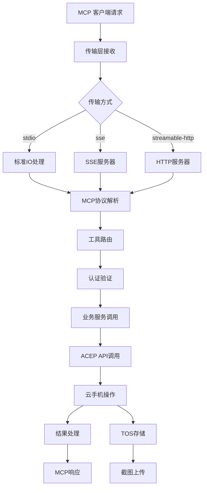
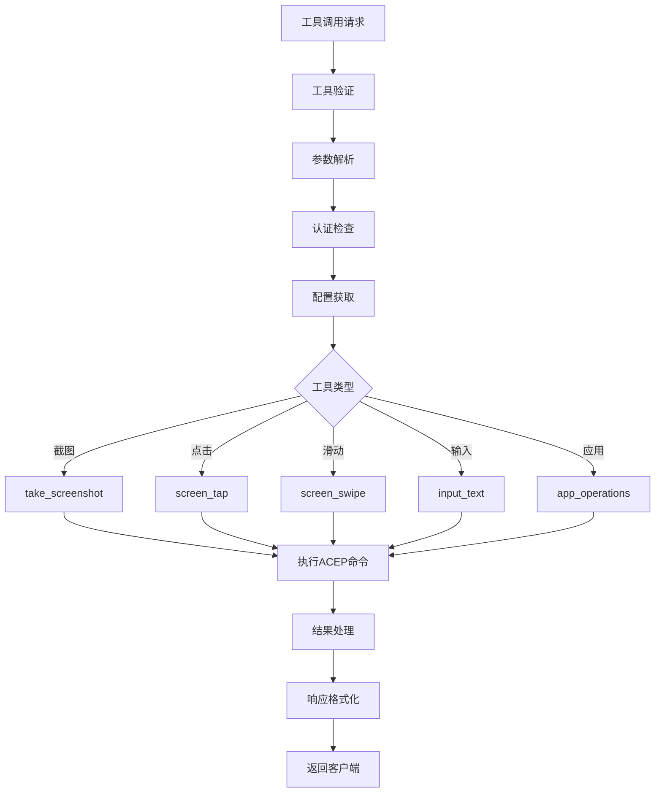
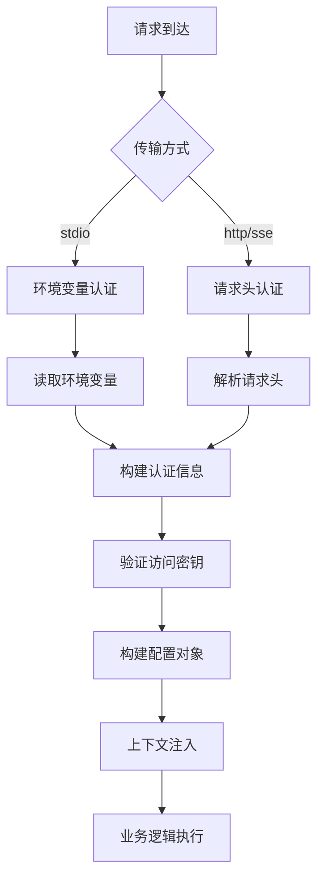

# Mobile Use MCP 核心逻辑与架构分析

## 项目概述

Mobile Use MCP 是基于 Go 语言开发的 MCP (Model Context Protocol) 服务器，专门为 AI Agent 提供云手机操作能力。该项目集成了火山引擎云手机 (ACEP) 和对象存储 (TOS) 服务，通过标准 MCP 协议为上层 AI 应用提供移动设备自动化工具。

## 核心架构

### 1. 项目结构

```
mobile_use_mcp/
├── cmd/
│   └── mobile_use_mcp/
│       └── main.go         # 应用入口
├── internal/
│   └── mobile_use/
│       ├── config/         # 配置管理
│       ├── consts/         # 常量定义
│       ├── server/         # MCP 服务器
│       ├── service/        # 业务服务
│       └── tool/          # 工具实现
├── pkg/
│   └── acep/              # 火山引擎云手机 SDK
├── go.mod                 # Go 模块定义
└── build.sh              # 构建脚本
```

### 2. 核心组件

#### 2.1 MCP 服务器
- **位置**: `internal/mobile_use/server/server.go`
- **职责**: MCP 协议实现和服务管理
- **支持的传输方式**:
  - `stdio`: 标准输入输出
  - `sse`: Server-Sent Events
  - `streamable-http`: HTTP 流式传输

#### 2.2 移动设备服务提供者
- **位置**: `internal/mobile_use/service/provider.go`
- **职责**: 封装云手机操作的核心业务逻辑
- **主要接口**:
  - 截图操作
  - 点击和滑动
  - 文本输入
  - 应用管理
  - 按键事件

#### 2.3 工具集合
- **位置**: `internal/mobile_use/tool/`
- **功能**: 将业务操作封装为 MCP 工具
- **工具类型**:
  - 截图工具
  - 交互工具
  - 应用管理工具
  - 系统控制工具

## 核心逻辑流程

### 主要执行流程



### 工具调用流程



### 认证和配置流程



## 关键技术实现

### 1. MCP 协议实现

#### 服务器初始化
```go
func NewMobileUseServer() *MobileUseServer {
    mcpServer := mcp_srv.NewMCPServer(
        "mobile_use_mcp_server",
        "0.0.1",
        mcp_srv.WithToolCapabilities(true),
    )
    
    // 注册工具
    mcpServer.AddTool(screenshotTool, HandleScreenshotTool())
    mcpServer.AddTool(tapTool, HandleTapTool())
    // ... 其他工具
    
    return &MobileUseServer{server: mcpServer}
}
```

#### 多传输方式支持
- **stdio**: 适用于命令行和脚本调用
- **sse**: 适用于 Web 应用实时通信
- **streamable-http**: 适用于 HTTP 客户端集成

### 2. 云手机操作实现

#### 截图操作
```go
func (impl *mobileUseImpl) ScreenShot(ctx context.Context) (*ScreenShotResult, error) {
    // 构建TOS配置
    tosConfig := TosConfig{
        AccessKey: impl.option.TosAccessKey,
        SecretKey: impl.option.TosSecretKey,
        Bucket:    impl.option.Bucket,
        Region:    impl.option.Region,
        Endpoint:  impl.option.Endpoint,
    }
    
    // 执行截图命令
    command := fmt.Sprintf(consts.ACEPCommandScreenShotFormat, tosConf)
    output, err := impl.runSyncCommand(ctx, command, consts.ACEPCommandTypeRoot)
    
    // 解析截图URL
    return extractScreenshotURL(*output)
}
```

#### 交互操作
```go
func (impl *mobileUseImpl) ScreenTap(ctx context.Context, x, y int) error {
    command := fmt.Sprintf(consts.ACEPCommandScreenTapFormat, x, y)
    _, err := impl.runSyncCommand(ctx, command, consts.ACEPCommandTypeShell)
    return err
}

func (impl *mobileUseImpl) ScreenSwipe(ctx context.Context, fromX, fromY, toX, toY int) error {
    command := fmt.Sprintf(consts.ACEPCommandScreenSwipeFormat, fromX, fromY, toX, toY)
    _, err := impl.runSyncCommand(ctx, command, consts.ACEPCommandTypeShell)
    return err
}
```

### 3. 工具封装

#### 工具定义
```go
func NewScreenshotTool() mcp_srv.Tool {
    return mcp_srv.Tool{
        Name:        "take_screenshot",
        Description: "Take a screenshot of the mobile device",
        InputSchema: mcp_srv.ToolInputSchema{
            Type:       "object",
            Properties: map[string]interface{}{},
        },
    }
}
```

#### 工具处理器
```go
func HandleScreenshotTool() mcp_srv.ToolHandler {
    return func(ctx context.Context, request mcp_srv.CallToolRequest) (*mcp_srv.CallToolResult, error) {
        provider := GetMobileUseProvider(ctx)
        result, err := provider.ScreenShot(ctx)
        if err != nil {
            return nil, err
        }
        
        return &mcp_srv.CallToolResult{
            Content: []mcp_srv.Content{{
                Type: "text",
                Text: formatScreenshotResult(result),
            }},
        }, nil
    }
}
```

## 支持的工具集

### 1. 截图工具
- **take_screenshot**: 获取设备屏幕截图
- **返回**: 截图URL、宽度、高度信息

### 2. 交互工具
- **screen_tap**: 点击屏幕指定坐标
- **screen_swipe**: 在屏幕上执行滑动操作
- **input_text**: 输入文本内容
- **input_text_clear**: 清除输入内容

### 3. 应用管理工具
- **auto_install_app**: 自动安装应用
- **launch_app**: 启动指定应用
- **close_app**: 关闭指定应用
- **list_apps**: 获取应用列表

### 4. 系统控制工具
- **key_event_back**: 返回键
- **key_event_home**: 主页键
- **key_event_menu**: 菜单键

## 配置管理

### 1. 环境变量配置

#### 必需配置
```bash
# 云手机配置
ACEP_ACCESS_KEY=your_access_key
ACEP_SECRET_KEY=your_secret_key
ACEP_PRODUCT_ID=your_product_id
ACEP_DEVICE_ID=your_device_id

# TOS存储配置
TOS_ACCESS_KEY=your_tos_access_key
TOS_SECRET_KEY=your_tos_secret_key
ACEP_TOS_BUCKET=your_bucket
ACEP_TOS_REGION=your_region
ACEP_TOS_ENDPOINT=your_endpoint
```

### 2. 请求头配置（HTTP/SSE模式）

```http
Authorization: Bearer your_auth_token
X-ACEP-DeviceId: your_device_id
X-ACEP-ProductId: your_product_id
X-ACEP-TosBucket: your_bucket
X-ACEP-TosRegion: your_region
X-ACEP-TosEndpoint: your_endpoint
```

## 部署和使用

### 1. 编译和启动

```bash
# 编译
./build.sh

# stdio 模式启动
./output/mobile_use_mcp --transport stdio

# SSE 模式启动
./output/mobile_use_mcp --transport sse --port 8080

# HTTP 模式启动
./output/mobile_use_mcp --transport streamable-http --port 8080
```

### 2. 客户端集成

#### Go 客户端示例
```go
// stdio 方式
cli, err := mobile_use_client.NewMobileUseStdioClient(ctx, cmd, env, args...)

// HTTP 方式
cli, err := mobile_use_client.NewMobileUseHTTPClient(ctx, serverURL, headers)

// 调用工具
result, err := cli.CallTool(ctx, "take_screenshot", map[string]interface{}{})
```

## 优势与特点

### 1. 技术优势
- **标准协议**: 基于 MCP 开放标准
- **多传输支持**: 灵活的通信方式
- **高性能**: Go 语言的高并发特性
- **云原生**: 容器化部署支持

### 2. 集成优势
- **火山引擎深度集成**: 原生支持云手机和存储服务
- **工具化封装**: 标准化的操作接口
- **认证安全**: 完善的权限验证机制
- **错误处理**: 健壮的异常处理机制

### 3. 扩展性
- **工具扩展**: 易于添加新的操作工具
- **平台扩展**: 支持不同云服务提供商
- **协议扩展**: 可扩展的 MCP 协议实现

Mobile Use MCP 作为移动自动化的基础设施层，通过标准化的 MCP 协议为上层 AI 应用提供了强大、可靠的移动设备操作能力。
