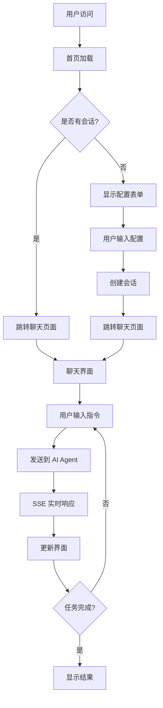
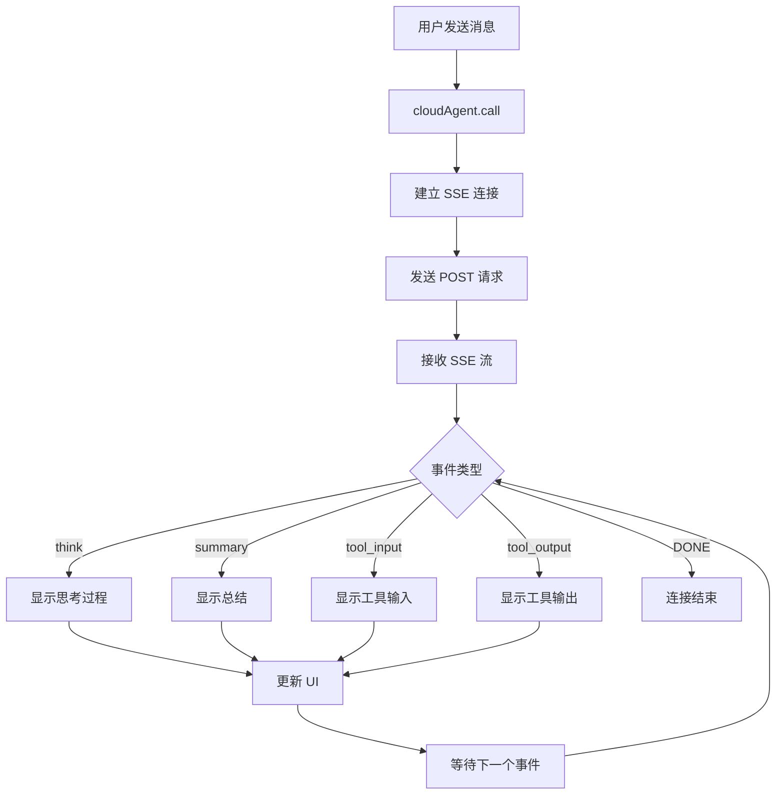
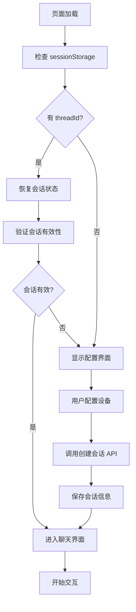

# Web 前端核心逻辑与架构分析

## 项目概述

Web 前端是基于 Next.js 15 开发的现代化 React 应用，为 Mobile Use 解决方案提供用户交互界面。该项目采用 App Router 架构，集成了实时通信、移动设备监控和任务管理功能，为用户提供直观的移动自动化操作体验。

## 核心架构

### 1. 项目结构

```
web/src/
├── app/                    # Next.js 应用路由
│   ├── api/               # API 路由处理器
│   ├── chat/              # 聊天页面组件
│   ├── layout.tsx         # 根布局
│   ├── page.tsx          # 首页
│   └── globals.css       # 全局样式
├── components/            # 可重用 UI 组件
│   ├── ui/               # 基础 UI 组件 (shadcn/ui)
│   ├── chat/             # 聊天相关组件
│   ├── phone/            # 移动屏幕组件
│   ├── common/           # 通用工具组件
│   └── resize/           # 可调整大小面板组件
├── hooks/                # 自定义 React Hooks
├── lib/                  # 工具库
├── styles/               # 附加样式表
├── types/                # TypeScript 类型定义
└── assets/               # 静态资源
```

### 2. 核心组件

#### 2.1 页面组件
- **首页 (page.tsx)**: 会话创建和设备配置
- **聊天页面 (chat/)**: 主要的交互界面
- **根布局 (layout.tsx)**: 全局布局和样式

#### 2.2 功能组件
- **ChatPanel**: 聊天交互面板
- **PhoneScreen**: 移动设备屏幕显示
- **MessageList**: 消息历史列表
- **ResizablePanel**: 可调整大小的面板

#### 2.3 工具库
- **cloudAgent**: 与后端 AI 服务通信
- **fetchAPI**: API 请求封装
- **SSE 处理**: 实时事件流处理

## 核心逻辑流程

### 主要用户流程



### SSE 通信流程



### 会话管理流程



## 关键技术实现

### 1. CloudAgent 核心类

#### 初始化和配置
```typescript
class CloudAgent {
  private _threadId?: string;
  private _podId?: string;
  private _chatThreadId?: string;
  private _abortController?: AbortController;
  
  constructor() {
    // 从 sessionStorage 恢复状态
    this._threadId = sessionStorage.getItem(MOBILE_USE_THREAD_ID_KEY) || undefined;
    this._podId = sessionStorage.getItem(MOBILE_USE_POD_ID_KEY) || undefined;
    this._chatThreadId = sessionStorage.getItem(MOBILE_USE_CHAT_THREAD_ID_KEY) || undefined;
  }
}
```

#### SSE 通信实现
```typescript
async call(message: string) {
  this.closeConnection();
  this._abortController = new AbortController();
  
  const readable = await fetchSSE(`/api/agent/stream`, {
    method: 'POST',
    body: JSON.stringify({
      thread_id: this._threadId,
      message,
      pod_id: this._podId,
    }),
    signal: this._abortController?.signal,
  });
  
  // 处理 SSE 流
  const reader = readable.getReader();
  const decoder = new TextDecoder();
  // ... 流处理逻辑
}
```

### 2. 事件处理系统

#### SSE 事件类型
```typescript
export type SSEMessage =
  | SSEThinkMessageData      // 思考过程
  | UserInterruptMessageData // 用户中断
  | SummaryMessageData       // 总结信息
  | SSEToolCallMessageData;  // 工具调用

export enum EVENT_KEY {
  MESSAGE = 'message',
  DONE = 'done',
}
```

#### 事件处理器
```typescript
interface MapKey {
  [EVENT_KEY.MESSAGE]: (json: SSEMessage) => void;
  [EVENT_KEY.DONE]: () => void;
}

// 注册事件处理器
cloudAgent.on(EVENT_KEY.MESSAGE, (message) => {
  switch (message.type) {
    case 'think':
      // 处理思考消息
      break;
    case 'summary':
      // 处理总结消息
      break;
    // ... 其他类型
  }
});
```

### 3. 状态管理

#### 会话状态持久化
```typescript
// 保存到 sessionStorage
setThreadId(threadId: string) {
  this._threadId = threadId;
  sessionStorage.setItem(MOBILE_USE_THREAD_ID_KEY, threadId);
}

setPodId(podId: string) {
  this._podId = podId;
  sessionStorage.setItem(MOBILE_USE_POD_ID_KEY, podId);
}

setChatThreadId(chatThreadId: string) {
  this._chatThreadId = chatThreadId;
  sessionStorage.setItem(MOBILE_USE_CHAT_THREAD_ID_KEY, chatThreadId);
}
```

#### React 状态管理
```typescript
// 使用 React Hooks 管理组件状态
const [messages, setMessages] = useState<Message[]>([]);
const [isLoading, setIsLoading] = useState(false);
const [currentTask, setCurrentTask] = useState<string>('');

// 全局状态通过 Context 共享
const CloudAgentContext = createContext<CloudAgent | null>(null);
```

## API 集成

### 1. 后端 API 调用

#### 会话管理 API
```typescript
// 创建会话
async function createSession(productId?: string, podId?: string) {
  const response = await fetchAPI('/api/session/create', {
    method: 'POST',
    body: JSON.stringify({
      thread_id: cloudAgent?.threadId,
      product_id: productId,
      pod_id: podId,
    }),
  });
  return response.data;
}

// 获取会话信息
async function getSession(threadId: string) {
  const response = await fetchAPI(`/api/session/${threadId}`);
  return response.data;
}
```

#### 智能体 API
```typescript
// 流式调用智能体
async function callAgent(message: string) {
  return cloudAgent?.call(message);
}

// 取消任务
async function cancelTask() {
  return cloudAgent?.cancel();
}
```

### 2. API 路由处理

#### 代理路由
```typescript
// app/api/[...path]/route.ts
export async function POST(request: Request, { params }: { params: { path: string[] } }) {
  const path = params.path.join('/');
  const baseUrl = process.env.CLOUD_AGENT_BASE_URL;
  
  // 代理到后端服务
  const response = await fetch(`${baseUrl}api/v1/${path}`, {
    method: 'POST',
    headers: request.headers,
    body: await request.text(),
  });
  
  return response;
}
```

## UI 组件设计

### 1. 聊天界面组件

#### 消息列表
```typescript
interface Message {
  id: string;
  type: 'user' | 'assistant' | 'system';
  content: string;
  timestamp: Date;
  metadata?: any;
}

function MessageList({ messages }: { messages: Message[] }) {
  return (
    <div className="message-list">
      {messages.map(message => (
        <MessageItem key={message.id} message={message} />
      ))}
    </div>
  );
}
```

#### 输入组件
```typescript
function ChatInput({ onSend, disabled }: ChatInputProps) {
  const [input, setInput] = useState('');
  
  const handleSubmit = () => {
    if (input.trim() && !disabled) {
      onSend(input);
      setInput('');
    }
  };
  
  return (
    <div className="chat-input">
      <textarea
        value={input}
        onChange={(e) => setInput(e.target.value)}
        onKeyDown={handleKeyDown}
        disabled={disabled}
      />
      <button onClick={handleSubmit} disabled={disabled}>
        发送
      </button>
    </div>
  );
}
```

### 2. 移动设备显示组件

#### 设备屏幕
```typescript
function PhoneScreen({ screenUrl, width, height }: PhoneScreenProps) {
  return (
    <div className="phone-screen">
      <div className="screen-container">
        {screenUrl ? (
          
        ) : (
          <div className="placeholder">等待设备连接...</div>
        )}
      </div>
    </div>
  );
}
```

## 配置和环境管理

### 1. 环境变量

```env
# 后端服务地址
CLOUD_AGENT_BASE_URL=http://localhost:8000/mobile-use/

# Next.js 配置
NODE_ENV=production
NEXT_TELEMETRY_DISABLED=1
```

### 2. Next.js 配置

```typescript
// next.config.ts
const nextConfig: NextConfig = {
  output: "standalone",  // 容器化部署
  experimental: {
    serverActions: true,
  },
};
```

## 优势与特点

### 1. 技术优势
- **现代化框架**: Next.js 15 + React 19
- **实时通信**: SSE 流式响应
- **响应式设计**: 适配不同屏幕尺寸
- **TypeScript**: 类型安全的开发体验

### 2. 用户体验
- **直观界面**: 聊天式交互方式
- **实时反馈**: 即时显示操作进度
- **设备监控**: 实时查看移动设备状态
- **任务管理**: 清晰的任务执行流程

### 3. 扩展性
- **组件化设计**: 可重用的 UI 组件
- **模块化架构**: 易于添加新功能
- **配置驱动**: 灵活的环境配置
- **API 抽象**: 标准化的后端集成

Web 前端作为用户与 Mobile Use 系统交互的主要界面，通过现代化的技术栈和优秀的用户体验设计，为移动自动化提供了直观、高效的操作平台。
